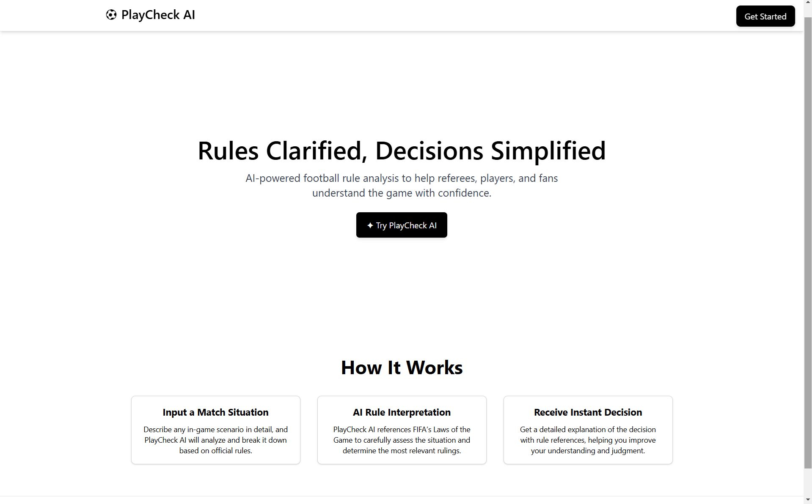
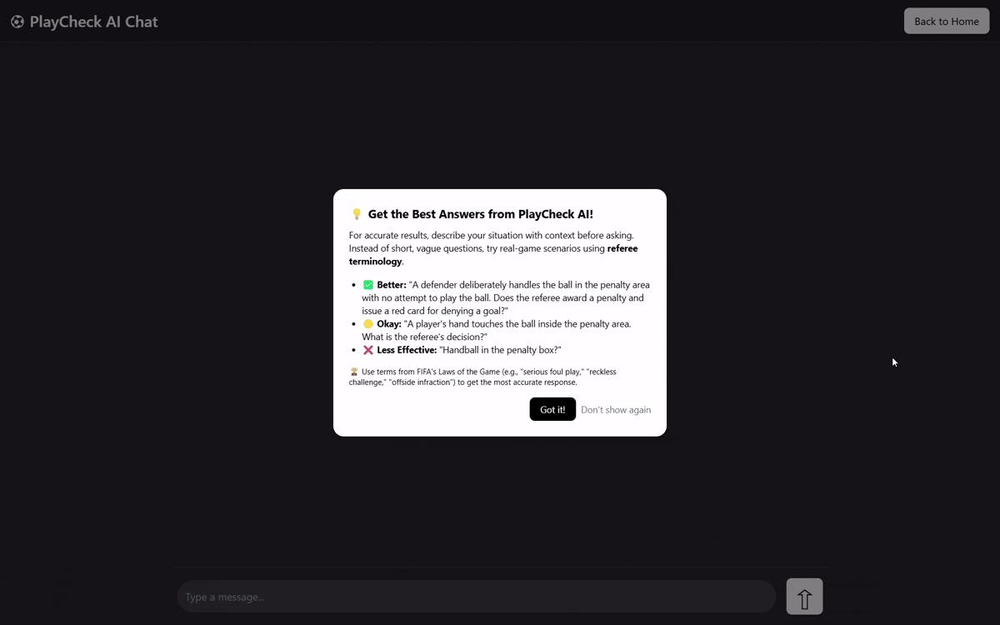

# ⚽︎ PlayCheck AI

## 📌 Overview

PlayCheck AI is an AI-powered football rules assistant designed to help users quickly understand FIFA's Laws of the Game. It allows users to ask questions about match scenarios and receive clear, structured responses based on the official rulebook.

Home Page  |  Chat Demo
:-------------------------:|:-------------------------:
   |  

 

## 🚀 Features 

- Uses AI-powered retrieval to find the most relevant FIFA law for a given query.

- Supports natural language questions, such as "Can a player take off their shirt when celebrating?" or "What happens if a goalkeeper holds the ball for too long?"

- Provides structured, easy-to-understand explanations based on FIFA's Laws of the Game.

- Optimized search with keyword expansion for improved accuracy.

 

## 🛠️ Tech Stack 

- Frontend: Node.js (HTML, Tailwind CSS, JavaScript)

- Backend: Python (Flask)

- AI Model: OpenAI API (GPT-4o-mini)

- Data Processing: Custom retrieval algorithm using FIFA Laws of The Game (JSON)

- Hosting & Deployment: Flask (Local Testing)

 

## 🌟 Future Improvements 

- Implement TF-IDF ranking for better retrieval accuracy.

- Improve response formatting for clearer, structured answers.

- Expand database to include additional football regulations and edge cases.

 

> [!NOTE]
> The source code is not publicly available, but this README serves as an overview of the project's functionality and vision.
